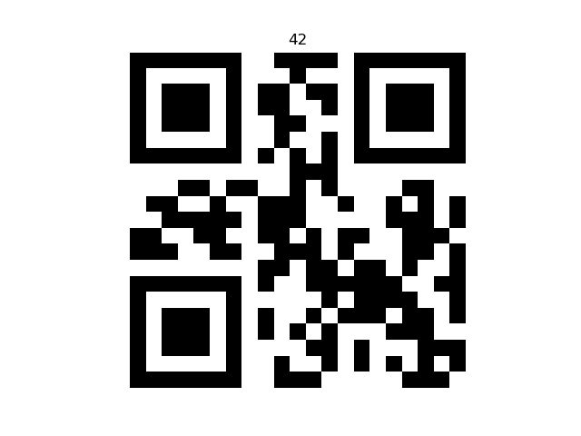
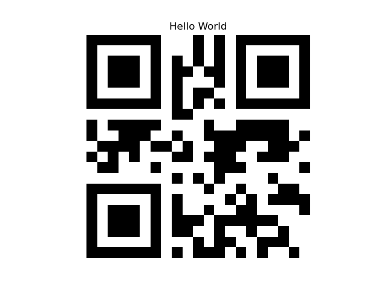

# 📱 QR Code Generator – Level 1 to 6

This repository contains from-scratch implementations of QR Code generators, including:

- QR_Code.py – Level 1 QR Codes

- QR_Code_Demo.py – Displays all calculations performed in Level 1. 

- QR_Code1_6.py – QR Codes from Level 1 to 6

- QR_Code1_6.py – QR Codes from Level 1 to 40  

The project was developed step by step to understand the **internal structure and encoding process** of QR codes, without relying on external libraries.

The implementation follows official specifications and well-documented educational resources.

## 🧠 About the Project

A QR code is much more than a simple black-and-white image. It relies on a precise pipeline involving:

- Data encoding

- Bitstream construction

- Error correction

- Matrix placement and masking

This project focuses on:

- Understanding the numeric encoding mode

- Implementing the QR Code structure manually

- Visualizing and debugging each step of the generation process

The original **QR_Code.py** supports Version 1 only, while **QR_Code1_6.py** extends support to Versions 1 through 6, making it suitable for larger data.

**QR_Code1_40.py** goes even further, supporting all **QR Code Versions from 1 to 40**, allowing for very large data capacities. It also supports multiple **error correction levels**, automatically outputs QR codes to the `export/` folder

## 🛠️ Technologies Used

- **Python**

- **NumPy**

- **Matplotlib**

- **Json**

- Standard Python libraries only (no QR generation packages)

## 📂 Files Description

`QR_Code.py`

Main implementation of the QR code generator.

This program:

- Encodes numeric data

- Builds the QR Code bitstream

- Applies error correction

- Generates a **Version 1 QR Code matrix**

- Outputs the final QR code

Designed to be **clean, concise, and functional**.

`QR_Code1_6.py`

Extended version of `QR_Code.py` supporting **QR Code Versions 1 to 6.**

`QR_Code1_40.py`

Extended version of `QR_Code.py` supporting **QR Code Versions 1 to 40.**

These programs:

- Handles larger data capacities

- Generates QR codes of multiple levels

- Outputs QR codes into the `export/` folder for further use

`QR_Code_Demo.py`

Educational and debug-oriented version of `QR_Code.py.`

This program:

- Performs the same operations as `QR_Code.py`

- Prints **each step of the QR Code generation process** in the terminal

- Displays intermediate representations (encoding, bitstream, matrix construction)

Useful for:

- Understanding the QR Code algorithm

- Debugging

- Learning purposes

## 📁 Subfolders

`utils/`

Contains supporting data and configuration files required by the QR code generator:

- `log_table.npy` – Lookup table for **logarithm conversion and anti-log conversion**

- `qr_capacity.json` – Maximum number of bits allowed for each **encoding mode**

- `qr_rs_structure.json` – Defines the **size of error correction codewords** for different QR code configurations

- `qr_rs_structure.json` – Defines the **size of error correction codewords** for different QR code configurations

- `qr_alignment_patterns.json` – Defines the coordinates for placing **alignment patterns** in each QR Code version.

These files allow the generator to handle QR codes properly according to the specification.

---

`export/`

This folder is where all **generated QR codes** are saved:

- Each QR code is exported as an image file (PNG)

- You can view all generated QR codes in this folder using any image viewer

- Ideal for quick reference or use in other applications

## 🖼️ Displayed QR Codes

Here are some examples of QR codes generated with this project:

## 📚 References & Sources

This project is based on the following high-quality resources:

- Thonky – QR Code Tutorial  
  https://www.thonky.com/qr-code-tutorial/

- Nayuki – Creating a QR Code Step by Step  
  https://www.nayuki.io/page/creating-a-qr-code-step-by-step

- YouTube – I built a QR code with my bare hands to see how it works  
  https://www.youtube.com/watch?v=w5ebcowAJD8

---

## 🚀 Notes

- This project is **educational** and not intended to replace production-ready QR libraries

- **Versions 1 to 6 QR Codes** are supported (with `QR_Code1_6.py`)

- **Versions 1 to 40 QR Codes** are supported (with `QR_Code1_40.py`)

- The focus is on **clarity, correctness, and understanding**, not performance
